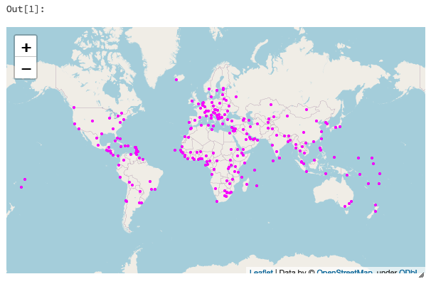

# Concurrent Jobs

Create a job using the absolute path of the notebook. The result of a job execution is a reference to the job run.

```python
from bricklayer.api import DBSApi
job = DBSApi().create_job('/Shared/bricklayer_examples/dummy_job')
run = job.run_now()
run.run_id
```
```
Out[3]: 60286
```
Stop the job.
```python
job.stop()
```
Can also reference a notebook with a relative path to the current notebook.
```python
job = DBSApi().create_job('./dummy_job')
```
Difference between this and `dbutils.notebook.run` is that the bricklayer call is non-blocking. So many jobs can be created to run concurrently.
```python
runs = []
for x in range(3):
    job = DBSApi().create_job('./dummy_job')
    runs.append(job.run_now())
```
The returned run objects can be used to monitor the execution and retrieve the results of every job execution.
```python
run_data = []
for run in runs:
    run_data.append(dict(
        id=run.run_id,
        life_cycle_state=run.life_cycle_state,
        result_state=run.result_state,
        output=run.get_run_output()
    ))
pd.DataFrame(run_data)
```

```
id	life_cycle_state	result_state	output
0	61077	            TERMINATED	    SUCCESS	{'result': 'Random number=71 and param=None', ...
1	61102	            TERMINATED	    SUCCESS	{'result': 'Random number=40 and param=None', ...
2	61131	            TERMINATED	    SUCCESS	{'result': 'Random number=91 and param=None', ...
```
Existing jobs can be retrieved using the job name and terminate their runs:
```python
for job in DBSApi().list_jobs(job_name='dummy_job'):
    print(job.job_id)
    job.stop()
```
Parameters can be passed to jobs:
```python
job = DBSApi().create_job('/Shared/bricklayer_examples/dummy_job')
run = job.run_now(notebook_params={'PARAM':'PARAM_VALUE'})
```
By default jobs run in the same cluster of the notebook making the call, other existing clusters can be used referencing them by name or id.
```python
job = DBSApi().create_job('./dummy_job',cluster_name='Shared Writer')
# or job = DBSApi().create_job('./dummy_job',cluster_id='doishdsfsdfsd9f80dfsdf098')
job.run_now()
```
This example shows how to run jobs with a max number of concurrent runs. This can help when we have capacity limits in CPU in the infrastructure side.
```python
import time
NUM_JOBS_TO_RUN = 6
MAX_CONCURRENT_JOBS = 3
jobs_to_run = [
    DBSApi().create_job('./dummy_job') for x in range(NUM_JOBS_TO_RUN)
]
runs = []
while True:
    running_runs = list(filter(lambda r:r.life_cycle_state !='TERMINATED', runs))
    print(f'running runs:{len(running_runs)}')
    if len(running_runs) < MAX_CONCURRENT_JOBS:
        if not jobs_to_run:
            break
        job_to_run = jobs_to_run.pop()
        new_run = job_to_run.run_now()
        runs.append(new_run)
    else:
        time.sleep(2)
print('done')
```
Jobs will run but there will be no more than 3 jobs running concurrently.
```
running runs:0
running runs:1
running runs:2
running runs:3
...
running runs:3
running runs:2
done
```

# Easy map rendering.
Maps can be rendered easily in notebooks by using the classes in `bricklayer.display.map` which uses [folium](https://github.com/python-visualization/folium). A `Map` can get contain one or more `Layer` objects. Each layer can render a set of geo-data. A layer rendering can be customized in the constructor call with the arguments:

- `data` You can pass as data a pandas dataframe, or a geodataframe or a spark dataframe or a databricks SQL query.
- `popup_attrs` A list of the attributes used to populate a pop up, if not passed there will be no popup. If True is passed instead it will put all the attrs.
- `color` Color to render the layer. Color name or RGB. (i.e. '#3388ff')
- `weight` Width of the stroke when rendering lines or points. By default is 1.
- `radius` Radius of the circles used for points default is 1.

The map rendering will try to adjust the displayed location to the location of the features in the layer.

```python
from bricklayer.display.map import Layer, Map
import geopandas as gp
Map([
  Layer(
      gp.read_file('https://d2ad6b4ur7yvpq.cloudfront.net/naturalearth-3.3.0/ne_110m_populated_places_simple.geojson'),
      color='magenta',
      weight=2
  )
]).render()
```


The `popup_attrs` can be used to display attributes of the map features from the data source.
```python
Map([
  Layer(
      gp.read_file('https://opendata.arcgis.com/datasets/1f3cb954526b471596dbffa30e56bb32_0.geojson'),
      popup_attrs=['SITE_NAME']
  )
]).render()
```
Then click over the features can render a pop-up with the attributes values for the given feature.

